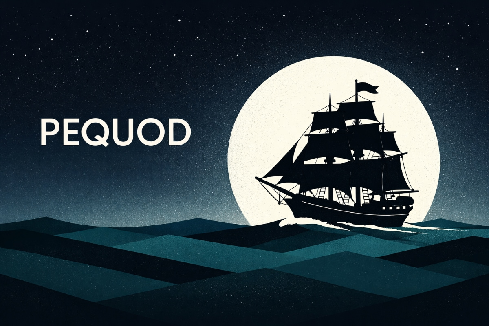
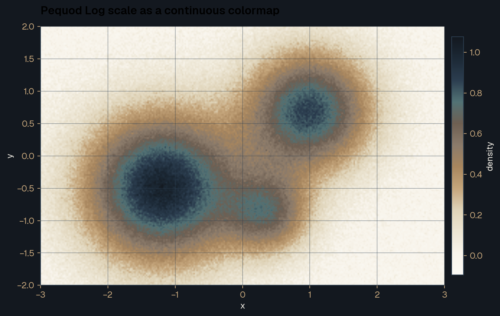
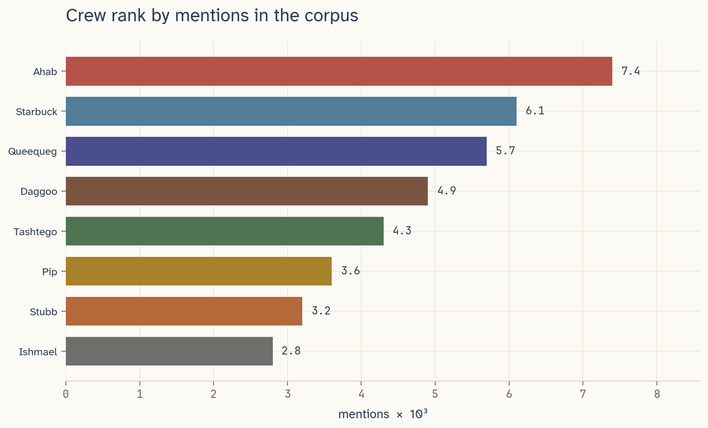

# Pequod

A pigment-inspired colour palette for reading and code, rooted in *Moby-Dick*.
Warm paper on one end, deep ink on the other, with eight accent hues named
after the crew of the Pequod.

[](https://pypi.org/project/pequod/)
[](https://www.npmjs.com/package/pequod-tailwind)
[](https://marketplace.visualstudio.com/items?itemName=tiagojct.pequod-color-theme)
[](https://open-vsx.org/extension/tiagojct/pequod-color-theme)
[](https://CRAN.R-project.org/package=pequod)
[](#licence)



- **Base scale:** twelve steps from Log 50 (warm paper) to Log 950 (night sky).
- **Accents:** eight crew members — Ahab, Starbuck, Queequeg, Pip, Ishmael,
  Stubb, Tashtego, Daggoo — each with a light and a dark variant and a
  recommended syntax role.
- **Read-first:** designed for long-form reading and code at length, not
  for glance-ability. Saturation stays low, backgrounds stay warm, accents
  stay in the same pigment register.
- **Accessibility:** every body-text pair clears WCAG-AA (4.5:1) on the
  reference surface; dark-mode accents clear 4.5:1 comfortably. Colour-
  vision-deficiency collapses are documented, not hidden — see below.
- **Semantics, not decoration:** each accent has a role. Using the palette
  should feel earned; the colour choice should tell you something.

The full narrative and design rationale live at
<https://tiagojct.eu/projects/pequod/>. This repository is the canonical
source of truth for the tokens and the built themes.

## Status

**Alpha (0.1.0).** Tokens are stable enough to run a website on them and
to publish across every ecosystem the palette ships into:

| Surface | Where | Status |
|---|---|---|
| VS Code extension | [Marketplace](https://marketplace.visualstudio.com/items?itemName=tiagojct.pequod-color-theme), [Open VSX](https://open-vsx.org/extension/tiagojct/pequod-color-theme) | live |
| Zed theme | `themes/Pequod.zed.json` | drop-in |
| Terminal presets | `themes/terminals/` | Ghostty, Alacritty, kitty, WezTerm, tmux, Windows Terminal, iTerm2 |
| Python package | [PyPI](https://pypi.org/project/pequod/) | `pip install pequod` |
| Tailwind plugin | [npm](https://www.npmjs.com/package/pequod-tailwind) | `npm install pequod-tailwind` |
| R package | [CRAN](https://CRAN.R-project.org/package=pequod) | `install.packages("pequod")` |
| Specimen PDF | `specimen/specimen.pdf` | regenerated from tokens |

Hex values may still shift by a point or two during the alpha — palette
testing continues against more code and long-form prose. Breaking
changes before 1.0 will be called out in `CHANGELOG.md`.

## Showcase

Eight hero plots in matplotlib — sequential heatmaps, grouped and
horizontal bars, scatter, box plots, distributions, time series,
and a specimen-style swatch grid. Four on dark, four on light:




Titles in Atkinson Hyperlegible Next SemiBold, ticks in JetBrains Mono, surfaces and series
colours pulled directly from `pequod.LOG`, `pequod.CREW_LIGHT`, and
`pequod.CREW_DARK`. Full gallery, code patterns, and reproduction
instructions live in [`examples/`](examples/). Generate them
yourself with:

```bash
pip install "pequod[plot]" numpy
python examples/plots.py
```

## Contents

```
pequod/
├── pequod.json                  # the canonical palette tokens
├── themes/
│   ├── Pequod.itermcolors                 # iTerm2 (dark)
│   ├── Pequod-color-theme.json            # VS Code (dark) — canonical
│   ├── Pequod-light-color-theme.json      # VS Code (light) — canonical
│   ├── Pequod.zed.json                    # Zed (dark + light in one file)
│   └── terminals/                         # Ghostty, Alacritty, kitty,
│                                          # WezTerm, tmux, Windows Terminal
├── tailwind/                    # npm package — `npm install pequod-tailwind`
├── vscode/                      # VS Code extension — `make vsix` builds
│   │                            # the .vsix; published to the Marketplace
│   │                            # as "tiagojct.pequod-color-theme"
│   ├── package.json
│   ├── icon.png
│   └── themes/                  # copies of the canonical themes
├── python/                      # Python package — install with
│   │                            #   pip install pequod
│   ├── pyproject.toml           # see python/README.md for full Python docs
│   ├── src/pequod/              # palette + matplotlib helpers
│   ├── tests/
│   └── data-raw/                # generator: re-reads ../pequod.json
├── r/                           # R package — install with
│   │                            #   remotes::install_github(
│   │                            #     "tiagojct/pequod", subdir = "r")
│   ├── DESCRIPTION              # see r/README.md for full R docs
│   ├── R/                       # palette constants, ggplot2 scales
│   ├── tests/
│   └── data-raw/                # generator: re-reads ../pequod.json
├── specimen/
│   ├── specimen.typ             # single-page specimen source (Typst)
│   └── specimen.pdf             # rendered output — swatches + samples
├── scripts/
│   └── cvd_check.py             # Viénot–Brettel–Mollon CVD simulation + ΔE
├── Makefile                     # ~13 targets — see `make help`
├── README.md
├── CHANGELOG.md
├── LICENSE-CC-BY-4.0            # palette tokens and docs
└── LICENSE-MIT                  # theme files, scripts, R package
```

## Install

### VS Code

The themes ship as a marketplace extension under [`vscode/`](vscode/),
published as `tiagojct.pequod-color-theme` on both surfaces. Install
in any of three ways:

1. **Marketplace** — open *Extensions* (⌘⇧X), search **Pequod
   Palette**, install. Or use [the listing page](https://marketplace.visualstudio.com/items?itemName=tiagojct.pequod-color-theme).
   For VSCodium / Cursor / Gitpod, use the [Open VSX listing](https://open-vsx.org/extension/tiagojct/pequod-color-theme) instead.
2. **`.vsix` file** — build with `make vsix`, then
   `code --install-extension vscode/pequod-color-theme-0.1.0.vsix`.
3. **From source (no marketplace)** — copy the [`vscode/`](vscode/)
   folder to `~/.vscode/extensions/pequod-color-theme/`. VS Code will
   pick it up on next launch.

Then *Preferences: Color Theme* → pick **Pequod** or **Pequod Light**.

### Zed

Zed reads user themes directly from disk:

1. Copy `themes/Pequod.zed.json` to `~/.config/zed/themes/Pequod.zed.json`
   (create the folder if it does not exist).
2. Restart Zed → *theme selector: toggle* → pick **Pequod Dark** or **Pequod Light**.

### iTerm2

1. Open *Settings → Profiles → Colors → Color Presets → Import…*
2. Select `themes/Pequod.itermcolors`.
3. Apply the *Pequod* preset.

An iTerm2 light preset is on the roadmap.

### Other terminals

Drop-in dark presets for the most common terminals live in
[`themes/terminals/`](themes/terminals/):

| Terminal | File |
|---|---|
| Ghostty | `Pequod.ghostty` |
| Alacritty | `Pequod.alacritty.toml` |
| kitty | `Pequod.kitty.conf` |
| WezTerm | `Pequod.wezterm.lua` |
| tmux | `Pequod.tmux.conf` |
| Windows Terminal | `Pequod.windowsterminal.json` |

See [`themes/terminals/README.md`](themes/terminals/README.md) for the
install path each terminal expects.

### Tailwind CSS

```bash
npm install pequod-tailwind
```

```js
// tailwind.config.js
const pequod = require("pequod-tailwind");

module.exports = {
  theme: {
    extend: {
      colors: pequod.colors,    // log + all eight crew accents
    },
  },
};
```

```html
<body class="bg-log-50 text-log-800 dark:bg-log-950 dark:text-log-100">
  <h1 class="text-queequeg dark:text-queequeg-dark">Pequod</h1>
</body>
```

Full usage in [`tailwind/README.md`](tailwind/README.md).

### Python

```bash
pip install pequod              # palette + helpers
pip install "pequod[plot]"      # adds matplotlib glue
```

```python
from pequod import LOG, CREW_LIGHT, palette

palette("log")                  # 12-step Log scale, list of hex
palette("crew", n=5)            # first five crew accents

# matplotlib (with the [plot] extra)
import matplotlib.pyplot as plt
import pequod
pequod.register_cmaps()
plt.imshow(data, cmap="pequod_log")
```

Full usage in [`python/README.md`](python/README.md).

### R

The R package is on [CRAN](https://CRAN.R-project.org/package=pequod):

```r
install.packages("pequod")

library(pequod)
palette_pequod("log")              # 12-step Log scale
palette_pequod("crew", n = 5)      # first five crew accents
pequod_preview("crew")             # quick base-R preview
```

Source lives in [`r/`](r/); to follow the development version,
`remotes::install_github("tiagojct/pequod", subdir = "r")`.

ggplot2 scales are provided too:

```r
library(ggplot2)
ggplot(iris, aes(Sepal.Length, Sepal.Width, colour = Species)) +
  geom_point(size = 3) +
  scale_color_pequod_d(palette = "crew")
```

Full usage in [`r/README.md`](r/README.md).

## The tokens

`pequod.json` is the single source of truth. The file contains:

- `log` — the twelve-step base scale (Log 50 → Log 950).
- `accents` — the eight crew accents, each with `light`, `dark`, `role`,
  and a short `note` explaining the character and the syntax role.
- `roles` — semantic role → token mappings for light and dark modes
  (`bg`, `text`, `text-muted`, `link`, `accent-primary`, etc.).
- `syntax` — default mappings from syntax role to accent (keyword,
  string, comment, function, type, constant, variable, operator).

The R package, the Python package, the Typst specimen, and the CVD
test script all regenerate from `pequod.json` (see each one's
`data-raw/` or generator). The terminal presets and the editor themes
are still produced by hand; bringing them under the same generator
contract is the next priority — see `What comes next` below.

## Accessibility

Body-text contrast on the reference surfaces:

| Pair | Use | Ratio |
|---|---|---|
| Log 800 on Log 50 | light body | 10.5 : 1 |
| Log 700 on Log 50 | light link | 5.0 : 1 |
| Log 400 on Log 50 | muted / large text | 3.2 : 1 |
| Log 100 on Log 950 | dark body | 16.2 : 1 |
| Accent-light on Log 100 | UI accents | 3.3 – 6.9 : 1 |
| Accent-dark on Log 950 | dark-mode accents | 5.6 – 9.0 : 1 |

Five of eight light-mode accents clear 4.5:1 on Log 100 for body text
(Queequeg, Daggoo, Tashtego, Ishmael, Ahab). Pip, Stubb, and Starbuck
fall short; use them for bold, large text (≥ 18.7 px), or UI-only uses
where AA-large (3:1) is the relevant target.

### Colour vision deficiency

`scripts/cvd_check.py` simulates each accent at 100 % severity for
protanopia, deuteranopia, and tritanopia using the Viénot–Brettel–Mollon
(1999) model, and reports pairwise ΔE*~ab~ (CIE76, Lab D65) between
simulated accents. Worst-case collapses (ΔE < 10) documented:

- **Pip ↔ Stubb** — collapse under tritanopia (ΔE 1.0 light / 2.3 dark).
- **Ahab ↔ Daggoo** — collapse under protanopia (ΔE 4.6 / 2.8).
- **Ahab ↔ Stubb, Ahab ↔ Pip** — collapse under tritanopia.
- **Queequeg ↔ Tashtego** — close under tritanopia-dark (ΔE 7.2).

Queequeg and Starbuck stay separable across all three simulations
(minimum ΔE 15.8 in deuteranopia-dark).

**Usage guidance:** do not rely on colour alone to distinguish *Ahab/Daggoo*,
*Pip/Stubb*, *Ahab/Pip*, *Ahab/Stubb*, or *Queequeg/Tashtego*. Pair with
icon, shape, weight, or position where colour-blind-safe distinction
matters (error states, diff gutters, warning badges).

Run the check yourself:

```bash
python3 scripts/cvd_check.py
```

The script has no dependencies beyond NumPy.

## Specimen

A one-page A4 specimen — the full Log scale, the eight crew accents
with light and dark variants, a body-text sample, and a dark code
sample with every token coloured by its crew role — lives at
[`specimen/specimen.pdf`](specimen/specimen.pdf). Use it as a quick
reference when choosing which accent a new UI element should take,
or print it and pin it somewhere.

The PDF is generated from [`specimen/specimen.typ`](specimen/specimen.typ)
with [Typst](https://typst.app/). To regenerate after a token change:

```bash
make specimen
# equivalent to: typst compile specimen/specimen.typ specimen/specimen.pdf
```

Typst uses the system-installed Atkinson Hyperlegible Next and
JetBrains Mono. Install them from
[Google Fonts](https://fonts.google.com/specimen/Atkinson+Hyperlegible+Next)
if they are not already present.

## What comes next

- **Generators for the editor and terminal themes**, so the
  hand-maintained files in `themes/` and `themes/terminals/`
  regenerate from `pequod.json` the same way the R, Python, and
  specimen targets already do.
- **Light presets** for the terminals (currently dark only) and for
  iTerm2 specifically.
- **Vim / Neovim colourscheme** using [Lush](https://github.com/rktjmp/lush.nvim).
- **Tailwind v4 plugin** as a first-class plugin once Tailwind v4's
  plugin API stabilises (the current package works in v4 via
  `@theme` but isn't formally a v4 plugin yet).
- **Sublime Text, Helix, Emacs** — lower priority.

Contributions to any of these are welcome.

## Inspirations and credits

- [Flexoki](https://stephango.com/flexoki) by Steph Ango is the most
  direct inspiration. Pequod owes its philosophy — warm paper, cool
  ink, muted accents, published tokens — to Flexoki. Where Flexoki
  draws on earth pigments broadly, Pequod narrows the story to a
  ship, a century, and a text.
- [Solarized](https://ethanschoonover.com/solarized/) by Ethan
  Schoonover established the modern practice of designing palettes
  for reading first.
- [Tokyo Night](https://github.com/enkia/tokyo-night-vscode-theme)
  and [Nord](https://www.nordtheme.com/) are two other palettes with
  a disciplined colour story worth studying.
- Herman Melville, *Moby-Dick; or, The Whale* (1851), for the names.

## Licence

- **Palette tokens (`pequod.json`) and documentation** — [Creative Commons
  Attribution 4.0 International](https://creativecommons.org/licenses/by/4.0/).
  Use, adapt, ship; credit required. See `LICENSE-CC-BY-4.0`.
- **Theme files, scripts, and packages** (`themes/*`, `scripts/*`,
  `tailwind/*`, `vscode/*`, `python/*`, `r/*`, `specimen/*`) —
  [MIT](https://opensource.org/licenses/MIT). See `LICENSE-MIT`.

## Contact

If you use Pequod in a project or have a suggestion, I would love to
hear about it: [tiagojacinto@med.up.pt](mailto:tiagojacinto@med.up.pt),
or open an issue here.
