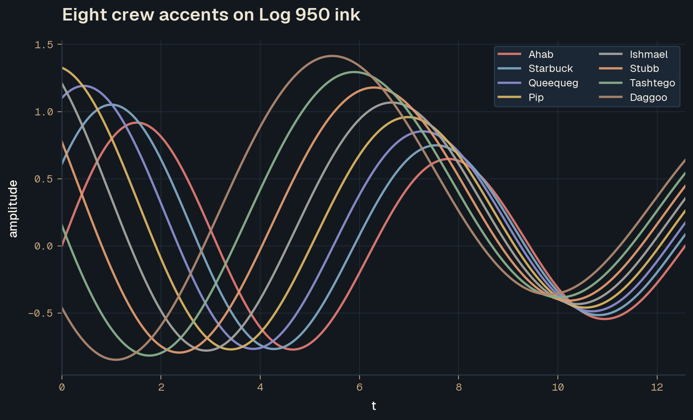
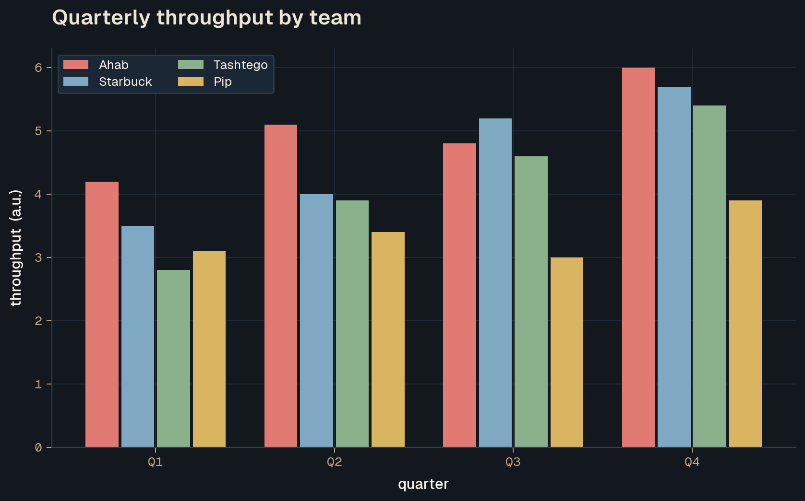
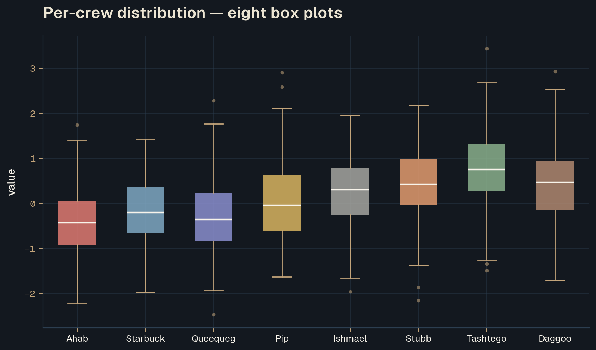
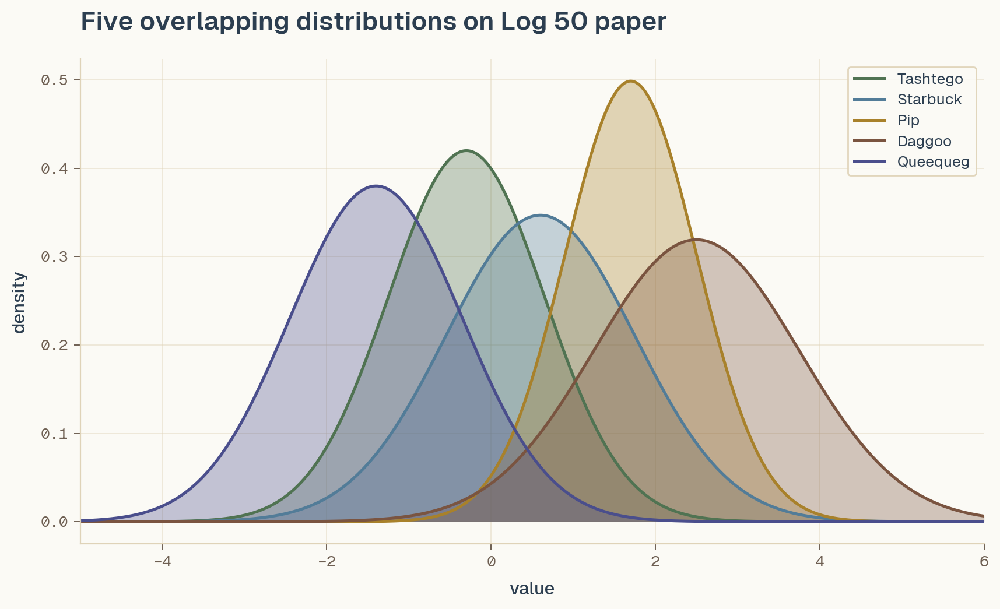
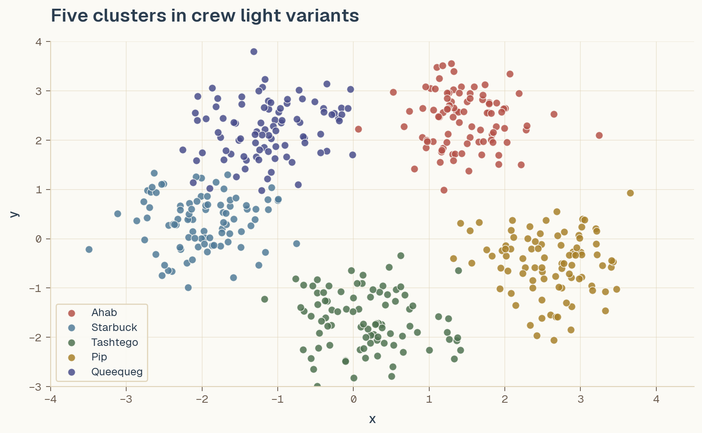
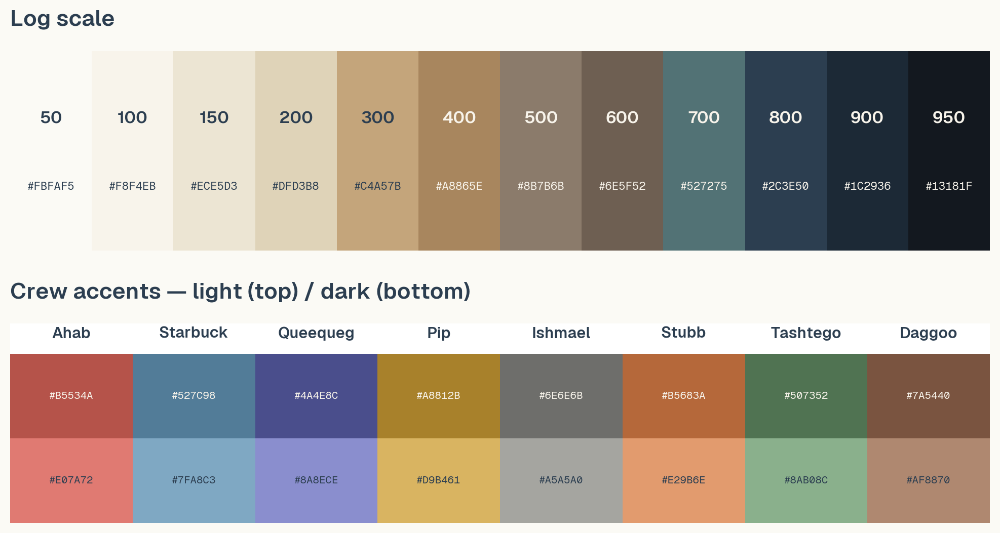

# Examples

Eight hero images showing what Pequod looks like in matplotlib —
four on the dark surface, four on light. Reproduce them with:

```bash
pip install "pequod[plot]" numpy
python examples/plots.py
```

The full source for every figure below is in
[`plots.py`](plots.py); under 350 lines, no helpers beyond
`pequod.register_cmaps()`, a `_theme()` function that paints the
axes with the palette's surface tokens, and a `_title()` helper
that sets the title in Geist SemiBold with the right contrast for
the surface.

## Dark surfaces

### 1 — Crew accents on Log 950

Eight sine series, each in a different crew dark variant. The
accents stay in their pigment register without competing.



### 2 — Log scale as a continuous colormap

Three Gaussian bumps rendered with `pequod_log` registered as a
matplotlib colormap. The warm-paper → deep-ink ramp does the
heavy lifting: the eye reads the scalar field instantly, with
no banding and no rainbow distortion.


### 6 — Grouped bars

Quarterly values across four crew teams. Subtle bar gaps,
left-aligned title in Geist SemiBold parchment, mono ticks on the
quarter labels.



### 8 — Box plots, eight crews

One box per crew member, ordered Ahab → Daggoo. Median lines in
cream, fliers in muted warm-taupe. Useful as a per-category
distribution comparison.



## Light surfaces

### 3 — Five overlapping distributions

Crew light variants with semi-transparent fills layered against
Log 50 paper. None of the five collapse to the same hue under
standard vision.



### 5 — Categorical scatter, five clusters

Same idea as the box-plot above but in 2D — five Gaussian
clusters, each tagged with a crew light hex.



### 7 — Horizontal bars (ranking)

Sorted ascending so the largest sits on top; mono value labels at
each tip; left spine hidden so the bars feel grounded on the
y-axis itself.


### 4 — Specimen-style swatch grid

The full Log scale (twelve steps) and the eight crew accents
(light + dark) in one figure. Auto-contrast labels — cream on
the dark cells, navy on the light ones.



## Patterns worth lifting

If you want to drop bits into your own plotting code, the three
patterns from `plots.py` worth borrowing are:

- **`pequod.register_cmaps()`** — call once per process, then
  use `cmap="pequod_log"` and friends like any built-in
  matplotlib colormap.
- **`_theme(ax, dark=True/False)`** — paints the facecolor,
  spine colour, grid colour, label colour, and tick colour from
  the palette tokens. Geist Mono is used for tick labels so
  digits line up.
- **`_title(ax, text, dark=True/False)`** — sets the title in
  Geist SemiBold with the correct contrast for the surface.
  matplotlib's `set_title` overrides title colour from rcParams,
  so this needs to be called *after* plotting (or instead of
  `set_title`).

For series colours, `pequod.CREW_DARK[name]` works on dark
backgrounds and `pequod.CREW_LIGHT[name]` works on paper. They
are already tuned for those surfaces.

## Reproducing on your machine

The script uses Geist as its primary font (matching the rest of
the project) and falls back to Inter, Helvetica Neue, Arial, and
DejaVu Sans in that order. Tick labels and value annotations use
Geist Mono with the same fallback chain. Install
[Geist](https://fonts.google.com/specimen/Geist) and
[Geist Mono](https://fonts.google.com/specimen/Geist+Mono) for the
closest match; everything else still renders, just with a
different typeface.
